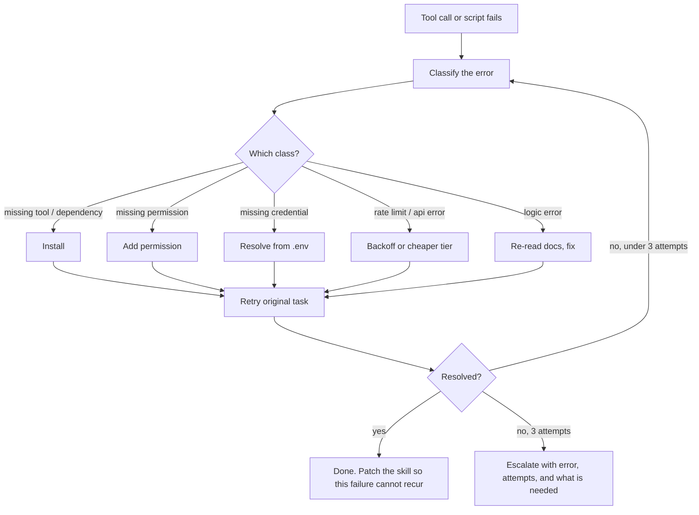

<div align="center">

# Agentic Command Center

**A reference architecture for reliable autonomous AI agents.**

[![License][license-badge]][license]
[![Sanitized extract][extract-badge]](.)
[![Eval-driven][eval-badge]](./evals)

[Source](.) · [Author portfolio][portfolio]

</div>

## The idea

A reference architecture for building autonomous agents that stay reliable as tasks get longer. It is a sanitized, secret-free extract of a larger private workspace, shipping the architecture and the genuinely reusable patterns, not private memory, client work, or credentials.

## What's inside

- **Skills as the unit of capability** (`.claude/skills/`) - six self-contained `SKILL.md` capabilities the harness loads by matching the request, so the model only pays the token cost of what it needs.
- **Role-based subagents** (`.claude/agents/`) - a `conductor` orchestrator that routes work to bounded specialists (`researcher`, `code-reviewer`, `debugger`), keeping raw tool output out of the main thread.
- **Guardrail hooks on every tool call** (`hooks/`) - a `PreToolUse` secret scan that blocks any write containing secret-shaped tokens, plus a `PostToolUse` redacted audit log. They run at the harness level, so the model cannot skip them.
- **Self-healing error recovery** (`.claude/rules/`) - a fixed classify, route, fix, retry loop that recovers from solvable failures before escalating.
- **Eval-driven development** (`evals/`) - every skill or tool gets a binary pass/fail eval, discovered and run by one script.

## How it works

When any tool call, command, or script fails, the agent runs a deterministic recovery loop before reporting back. It tries up to three times, then escalates.



The rule that binds this lives in `.claude/rules/autonomous-self-healing.md`. The patch-on-failure step is `.claude/rules/self-annealing.md`.

## Run the evals

The runner discovers every `evals/*/eval.sh`, runs each one, and reports a binary tally. No credentials needed.

```bash
evals/run_evals.sh            # run all evals
evals/run_evals.sh sarah-ai   # run one
```

```text
PASS  no-em-dashes
PASS  sarah-ai
----------------------------------------
pass=2 fail=0
```

The `sarah-ai` eval checks that a tool's demo mode runs fully offline (zero API keys), exits cleanly, and emits deterministic output. The `no-em-dashes` eval enforces a writing convention across the repo.

## Repo layout

| Path | Role |
| --- | --- |
| `AGENTS.md` | Portable, tool-agnostic agent instructions (read first) |
| `.claude/skills/` | Six curated, generic skills: the capability units |
| `.claude/agents/` | `conductor` orchestrator plus `researcher`, `code-reviewer`, `debugger` |
| `.claude/rules/` | Binding rules: self-healing, self-annealing, package-age guard, subagent SOP |
| `hooks/` | `pre_edit_secret_scan.py` (blocks secrets), `audit_log.py` (records calls) |
| `evals/` | `run_evals.sh` runner plus example evals and a self-contained demo target |
| `.env.example` | Variable names only, no values |
| `LICENSE` | MIT |

## Design notes

**Skills over MCP for recurring tasks.** A skill costs roughly sixty tokens to keep available and loads only when its description matches the request. A standing MCP server can cost ten thousand tokens or more in tool definitions every turn. For a capability used repeatedly, the skill wins on cost and stays version-controlled alongside the code.

**Hooks for guardrails, not prompts.** Some rules cannot be left to the model's judgment. A secret scan written as a prompt instruction can be reasoned around or forgotten under load. The same scan as a `PreToolUse` hook runs at the harness level on every write and blocks with a non-zero exit before any secret reaches disk. That is the difference between hoping the model behaves and guaranteeing it cannot leak a credential.

**Deterministic self-heal over ad-hoc retries.** At ninety percent accuracy per step, a five-step task succeeds only fifty-nine percent of the time. A fixed classify, route, fix, retry loop converts most failures into recoveries with bounded, predictable behavior, and the self-annealing step means each failure is patched so it cannot recur. Reliability rises with every run instead of resetting each session.

## License & author

MIT. See [LICENSE][license]. Some skills retain the upstream license noted in their frontmatter.

Built by Michael Sezer. [Portfolio][portfolio] · [Sibling project: sarah-ai][sarah-ai]

[license]: ./LICENSE
[license-badge]: https://img.shields.io/badge/License-MIT-5fc2b8?style=flat-square
[extract-badge]: https://img.shields.io/badge/sanitized-extract-3fb98f?style=flat-square
[eval-badge]: https://img.shields.io/badge/eval--driven-3fb98f?style=flat-square
[portfolio]: https://msstrategies.github.io
[sarah-ai]: https://github.com/msstrategies/sarah-ai
