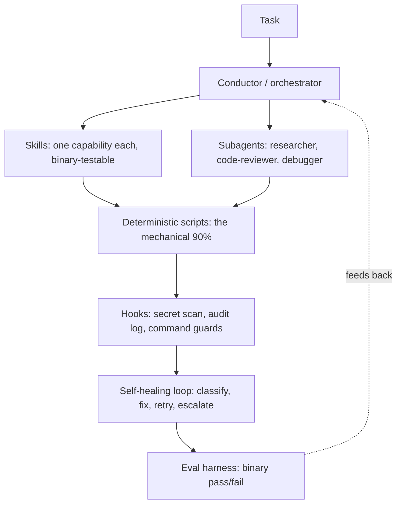

# Agentic Command Center

A reference architecture for building reliable autonomous AI agents. Skills as the unit of capability, role-based subagents, guardrail hooks on every tool call, a self-healing error-recovery loop, and eval-driven development.

Built to answer one question: how far can a single engineer scale by orchestrating agents instead of doing every step by hand?

> This is a curated, secret-free extract of a larger personal system. It ships the architecture and the genuinely reusable patterns, not private memory, client work, or credentials. Everything here is generic and educational. Drop it into any agent harness (Claude Code, Cursor, Codex, Windsurf) and adapt.

Sibling project: [github.com/msstrategies/sarah-ai](https://github.com/msstrategies/sarah-ai), an AI operations agent that the eval in this repo is modeled on.

---

## Why this exists

Working with an LLM one prompt at a time does not compound. Errors stack, context is lost between sessions, and the same problem gets re-solved every week. The math is unforgiving: at 90 percent accuracy per step, a five-step task succeeds only 59 percent of the time (0.9^5). The fix is not a better prompt. It is an architecture where capability accumulates and reliability rises with every run.

The core moves:

- Treat **skills as the unit of capability** so each new task starts from accumulated capability, not from zero.
- **Push the mechanical work into deterministic scripts** so the model only makes decisions, not brittle string manipulation.
- **Recover from failures automatically** with a classify-route-fix-retry loop.
- **Enforce the non-negotiables in hooks** that run at the harness level, where the model cannot skip them.
- **Prove correctness with binary evals** instead of vibes.

---

## Architecture

```text
                         ┌──────────────────────────────────────┐
                         │                Task                   │
                         └───────────────────┬──────────────────┘
                                             │
                                 ┌───────────▼───────────┐
                                 │  Conductor (router)    │   orchestrator pattern:
                                 │  classify, delegate,   │   a thin routing layer
                                 │  synthesize            │   keeps the main thread lean
                                 └───────────┬───────────┘
                  ┌──────────────────────────┼──────────────────────────┐
                  │                           │                          │
        ┌─────────▼─────────┐      ┌──────────▼─────────┐     ┌──────────▼─────────┐
        │     Skills        │      │     Subagents      │     │   Deterministic    │
        │ one job each,     │      │ researcher,        │     │   scripts          │
        │ binary-testable   │      │ code-reviewer,     │     │ the mechanical 90% │
        │ capability units  │      │ debugger, Explore  │     │ (idempotent)       │
        └─────────┬─────────┘      └──────────┬─────────┘     └──────────┬─────────┘
                  └──────────────────────────┼──────────────────────────┘
                                             │ every tool call
                                 ┌───────────▼───────────┐
                                 │   Hooks (guardrails)   │  secret scan (blocks),
                                 │   run at harness level │  audit log (records),
                                 │   model cannot skip    │  command guards
                                 └───────────┬───────────┘
                                             │ on any failure
                                 ┌───────────▼───────────┐
                                 │  Self-healing loop     │  classify, route to fix,
                                 │  3 attempts, then      │  retry, escalate
                                 │  escalate              │
                                 └───────────┬───────────┘
                                             │ proven by
                                 ┌───────────▼───────────┐
                                 │   Eval harness         │  binary pass/fail per
                                 │   evals/run_evals.sh   │  skill or tool
                                 └────────────────────────┘
```



---

## The five ideas

### 1. Skills as the unit of capability

A skill is a self-contained capability: a `SKILL.md` with frontmatter (name, description, trigger conditions), the instructions, and optionally supporting files and a binary eval. The harness loads a skill by matching the request against its description, so the model only pays the token cost of capabilities it actually needs.

Skills beat prompts because they accumulate. Solve a problem once, capture it as a skill, and every future session starts from that capability instead of re-deriving it. See `.claude/skills/` for six examples, including `systematic-debugging` (root-cause before fixes), `verification-before-completion` (evidence before claims), and `subagent-driven-development` (fresh subagent per task with two-stage review).

### 2. Role-based subagents

Specialized agents handle isolated roles: `researcher` (read plus web, returns a cited brief), `code-reviewer` (bounded, read-only review), `debugger` (systematic isolation). The `conductor` agent is the orchestrator. It classifies the incoming task, dispatches to the right specialist with a self-contained brief, parallelizes independent subtasks, and synthesizes the results.

The point is context hygiene. Raw tool output (file dumps, web crawls, multi-route checks) stays inside the subagent. Only the summary returns to the parent. This is what lets a long task stay coherent. See `.claude/agents/` and `.claude/rules/subagents.md`.

### 3. Hooks as guardrails

Some rules cannot be left to the model's judgment. Hooks run at the harness level on every tool call, so they are not skippable:

- `hooks/pre_edit_secret_scan.py` is a `PreToolUse` hook that scans proposed file writes for secret-shaped tokens (API keys, private key blocks, JWTs) and blocks the write (exit code 2) before any secret can be committed. A path allowlist permits example files.
- `hooks/audit_log.py` is a `PostToolUse` hook that appends a redacted JSONL record of every tool call for observability. It never blocks.

This is the difference between hoping the model behaves and guaranteeing it cannot leak a credential.

### 4. The self-healing loop

When any tool call, command, or script fails, the agent runs a fixed loop before reporting back: classify the error (missing tool, missing dependency, missing credential, logic error, rate limit, and so on), route to the matching fix (install, add a permission, retry with backoff, fall back to a cheaper model tier), retry the original task, and escalate only after three attempts.

Combined with self-annealing (after a failure, patch the skill so the same failure is impossible next time), the system converges toward zero-failure execution. See `.claude/rules/autonomous-self-healing.md` and `.claude/rules/self-annealing.md`.

### 5. Eval-driven loops

Every skill or tool gets a binary eval: a script that exits 0 (pass) or non-zero (fail). `evals/run_evals.sh` discovers and runs them all. The included `evals/sarah-ai/` eval checks that a tool's demo mode runs fully offline (zero API keys), exits cleanly, and emits deterministic output. That is the smallest useful unit of reliability: a check you can run on every change.

```text
$ evals/run_evals.sh
PASS  sarah-ai
----------------------------------------
pass=1 fail=0
```

---

## Repository layout

```text
.
├── AGENTS.md                 portable, tool-agnostic agent instructions
├── .claude/
│   ├── skills/               6 curated, generic skills (capability units)
│   ├── agents/               conductor (orchestrator) + researcher, code-reviewer, debugger
│   └── rules/                self-healing, self-annealing, package-age-guard, subagent SOP
├── evals/
│   ├── run_evals.sh          binary eval runner (discovers evals/*/eval.sh)
│   └── sarah-ai/             example eval + self-contained demo target
├── hooks/
│   ├── pre_edit_secret_scan.py   blocks writes containing secret-shaped tokens
│   └── audit_log.py              append-only redacted audit log of tool calls
├── .env.example
├── .gitignore
└── LICENSE
```

---

## Quick start

```bash
# 1. Run the eval harness (no credentials needed)
evals/run_evals.sh

# 2. Try the secret-scan hook. It blocks a write containing a fake AWS access key
#    (a token shaped like AKIA followed by 16 uppercase or digit characters).
printf '%s' '{"tool_name":"Write","tool_input":{"file_path":"src/app.py","content":"k = FAKE_AWS_KEY"}}' \
  | python3 hooks/pre_edit_secret_scan.py; echo "exit=$?"

# 3. Wire the hooks and rules into your own agent harness, then add skills.
```

Read `AGENTS.md` first. It is the short, tool-agnostic summary. The detailed binding rules live in `.claude/rules/`.

---

## What is deliberately not here

Private memory, client work, real credentials, and personal data. This repo is the architecture and the reusable patterns, sanitized for public reference. Never commit `.env` (see `.gitignore`).

---

## License

MIT. See [LICENSE](LICENSE). Some skills retain their upstream license noted in their frontmatter.
